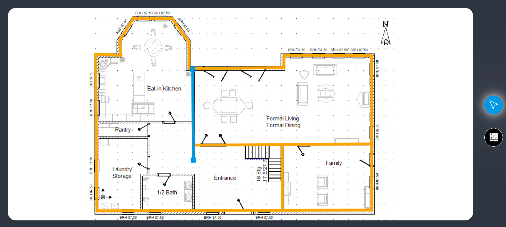

# Project Wall-Z

This web application tool lets you draw walls on top of the floor plan images. It makes reviewing and correcting floor plans quick and easy.

### Preview

## Technologies used:

1. React with TypeScript for UI.
2. Context API for state management.
3. Jest Snapshot for testing.

## Running the Application:

1. Install all dependencies

### `npm install`

2. Start the Application

### `npm start`

3. For testing

### `npm run test`

4. For building

### `npm run build`

Hosted on netlify: https://floor-planning.netlify.app/
